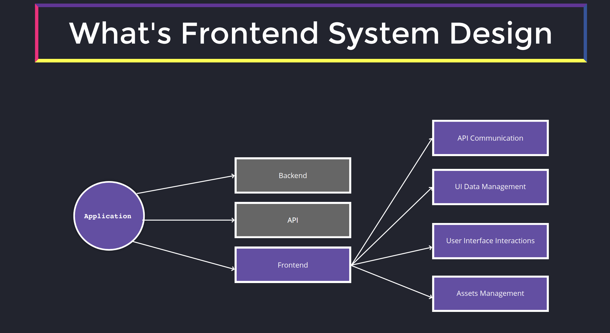
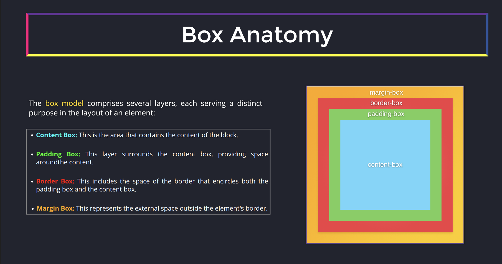
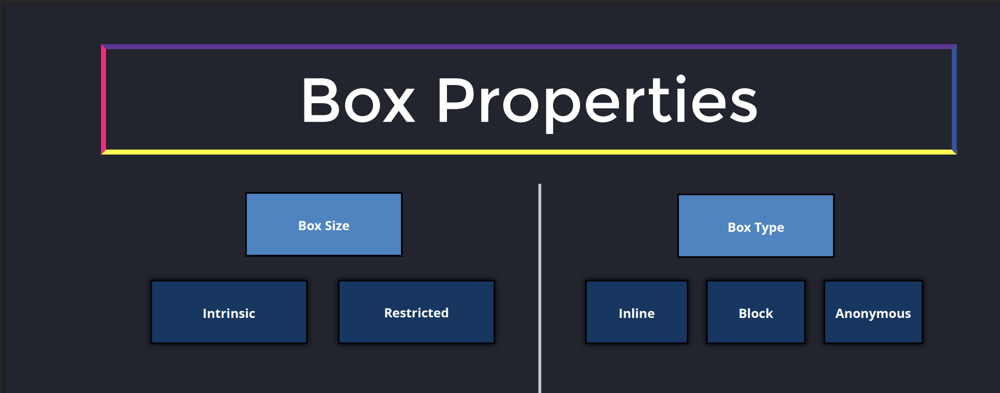
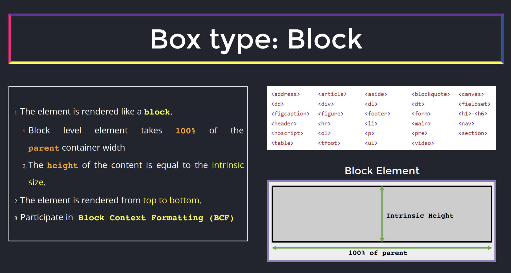
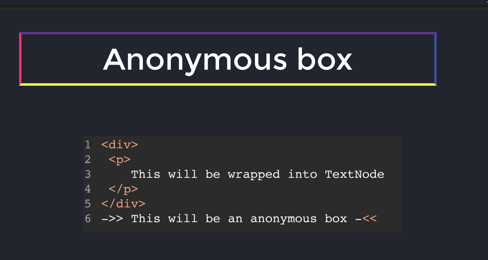
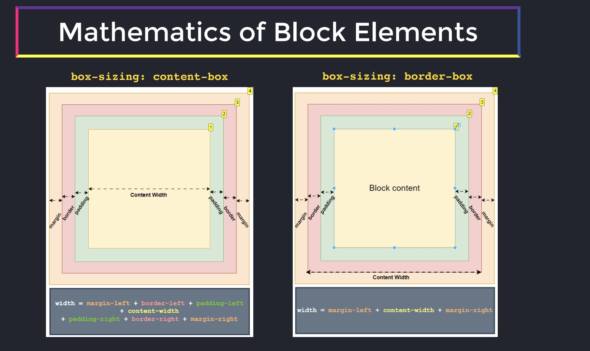
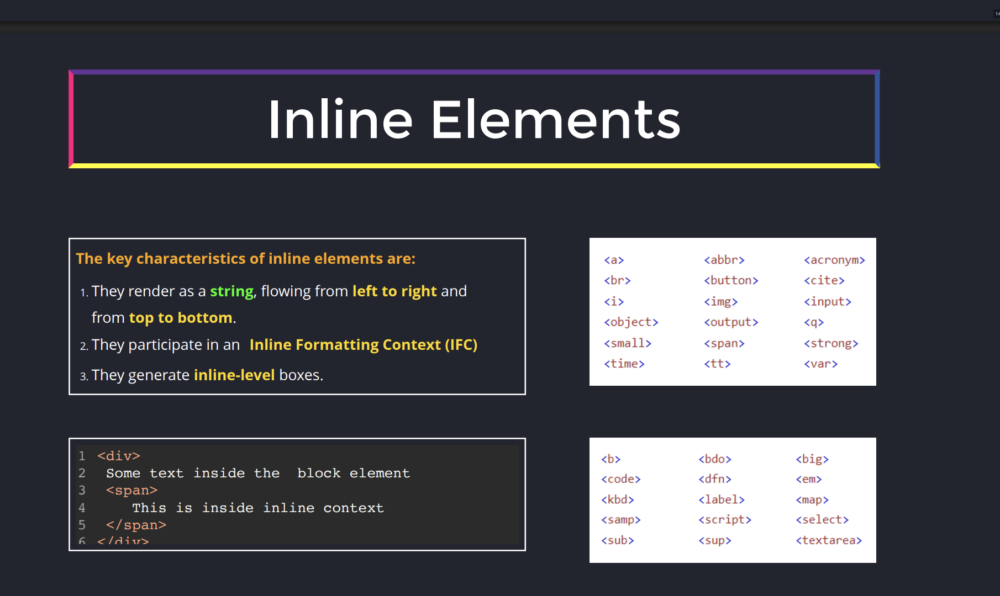

# FEM System Design

## Box Model

> The CSS box model is a fundamental web design concept where _every HTML element is treated as a rectangular box_, defining how its size and spacing are calculated. It consists of four layers: content (text/images), padding (inner space), border (frame), and margin (outer space). This structure determines layout and element positioning.

### Box Anatomy

### Box Prperties

### Box Size

The size can be:

🔹 Intrinsic - the box uses its content to determine the space it occupies

🔹 Restricted - the box's size is governed by a set of rules applied to it. It can be:

- Explicit width and height set via CSS
- Constrained by parent elements or other boxes through mechanisms like:
  - _Flex_ or _grid_ layout systems
  - _Percentage_ of parent size
  - The _aspect-ratio_ property of images, etc.
  - The presence of other children in the DOM tree

### Box type

There are several types of boxes:

🔹 **block** level (including, but not restricted by `display: block`)

🔹 **inline** level

🔹 **anonymous** box

#### Box Type: Block

[BFC](https://developer.mozilla.org/en-US/docs/Web/CSS/Guides/Display/Block_formatting_context)

#### Box Type: Anonymous

#### Math of Block Elements

#### Inline Elements

